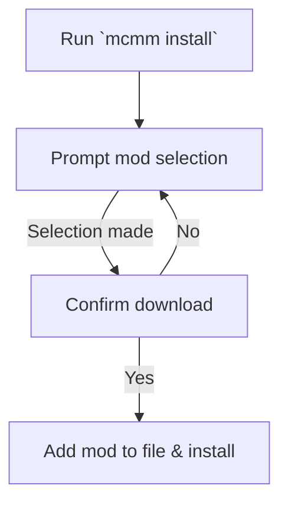

# MCMM

MCMM is a mod manager for Minecraft: Java Edition, similar to `apt`.
Integrated with CurseForge, MCMM aims to make installing, updating, and removing Minecraft mods easy.

## To-do

- [x] Search CurseForge for mods and filter by:
    - [x] Game version
    - [x] Modloader
- [ ] Determine per-project file format
- [ ] Determine conf file format
- [ ] Add mods to a `package.json`-style file
    - [ ] Keep track of mod dependencies
- [ ] Download mods and their dependencies
    - [ ] Allow user to specify version
    - [ ] Allow user to pick dependencies
- [ ] Update mods to the latest relevant version
- [ ] Remove mods, and if necessary, their dependencies

## Command Flow

## Depends

MMCM depends on the following `Node.js` packages:

- `Commander.js` for the CLI interface
- `Inquirer.js` for the interactive mod selection prompt
- `node-curseforge` for interfacing with the CurseForge API

## Installation

WIP

## Getting Started

WIP